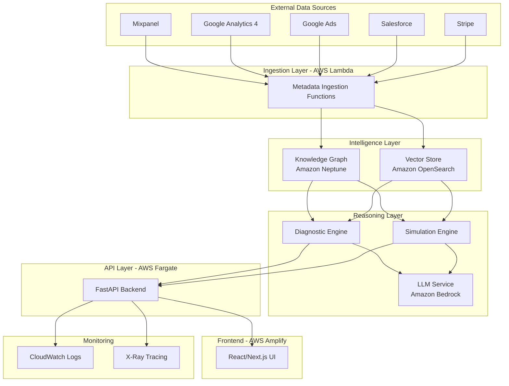

# Design Document: Vantage Reasoning Engine

## Overview

Vantage is an AI-driven business intelligence reasoning engine that automates root cause analysis and simulates business outcomes. The system operates on a metadata-only architecture, ingesting schema definitions, labels, and aggregated metrics from external data sources while never storing PII or raw data rows.

The architecture consists of three primary layers:

1. **Data Layer**: Metadata ingestion from external sources (Mixpanel, GA4, Google Ads, etc.)
2. **Intelligence Layer**: Knowledge Graph (Amazon Neptune) and Vector Store (Amazon OpenSearch) for relationship modeling and semantic search
3. **Reasoning Layer**: LLM-powered diagnosis and simulation using Amazon Bedrock

The system provides natural language interfaces for querying data, automated anomaly detection with root cause analysis, and predictive simulation of business changes before implementation.

## Architecture

### High-Level System Architecture



### Data Flow Architecture

**Metadata Ingestion Flow:**
1. AWS Lambda functions trigger on schedule (every 24 hours minimum)
2. Functions authenticate with external Data_Sources using OAuth 2.0 or API keys
3. Extract metadata only: schema definitions, labels, cohort definitions, aggregated metrics
4. Validate that no PII or raw data rows are included
5. Atomically update Knowledge_Graph and Vector_Store
6. Log ingestion status to CloudWatch

**Query Processing Flow:**
1. User submits natural language query via UI
2. FastAPI backend receives request with JWT authentication
3. Query is embedded using Amazon Bedrock Titan Embeddings
4. Vector_Store returns top 10 semantically similar contexts
5. Knowledge_Graph is queried for relevant relationships
6. Combined context is sent to LLM with system prompt
7. LLM generates response with citations
8. Response is validated against Knowledge_Graph
9. Result is returned to UI with supporting visualizations

**Anomaly Detection Flow:**
1. Scheduled Lambda checks all configured success metrics every 15 minutes
2. Calculate 3-sigma threshold on rolling 30-day baseline
3. If anomaly detected, trigger Diagnostic_Engine
4. Diagnostic_Engine scans all Data_Sources for correlations
5. Rank potential causes by signal strength
6. Generate plain-English explanation via LLM
7. Notify relevant users within 2 minutes
8. Present diagnosis in UI with supporting data

## Components and Interfaces

### 1. Metadata Ingestion Service

**Responsibility:** Extract metadata from external Data_Sources and load into Intelligence Layer

**Technology:** AWS Lambda (Python 3.11)

**Key Functions:**
- `ingest_mixpanel_metadata()`: Extract event schemas, property definitions, cohort definitions
- `ingest_ga4_metadata()`: Extract dimension/metric definitions, audience definitions
- `ingest_ads_metadata()`: Extract campaign structures, conversion definitions
- `validate_no_pii()`: Ensure no PII or raw data rows are included
- `update_knowledge_graph()`: Atomically update Neptune with new metadata
- `update_vector_store()`: Generate embeddings and update OpenSearch

**Interface:**
```python
class MetadataIngestionService:
    def ingest_from_source(
        self,
        source_type: DataSourceType,
        credentials: SourceCredentials
    ) -> IngestionResult:
        """
        Ingest metadata from external source.
        
        Args:
            source_type: Type of data source (MIXPANEL, GA4, etc.)
            credentials: OAuth tokens or API keys
            
        Returns:
            IngestionResult with status, metadata extracted, errors
        """
        pass
    
    def validate_metadata(self, metadata: Dict) -> ValidationResult:
        """
        Validate that metadata contains no PII or raw data.
        
        Args:
            metadata: Extracted metadata dictionary
            
        Returns:
            ValidationResult with is_valid flag and violations list
        """
        pass
```

**Error Handling:**
- Retry with exponential backoff (1s, 2s, 4s) on API failures
- Log failures to CloudWatch and alert administrators
- Continue with partial ingestion if some sources fail

### 2. Knowledge Graph Service

**Responsibility:** Store and query relationships between metrics, labels, and business entities

**Technology:** Amazon Neptune Serverless (Gremlin property graph)

**Schema Design:**

**Node Types:**
- `Metric`: Represents a measurable business metric (e.g., "conversion_rate", "revenue")
  - Properties: `name`, `data_type`, `source`, `description`, `unit`
- `Label`: Represents a categorical dimension (e.g., "campaign_type", "user_segment")
  - Properties: `name`, `values[]`, `source`, `description`
- `Cohort`: Represents a user segment definition
  - Properties: `name`, `definition`, `estimated_size`, `source`
- `DataSource`: Represents an external data source
  - Properties: `name`, `type`, `connection_status`, `last_sync`
- `Event`: Represents a business event (deployment, config change, external news)
  - Properties: `name`, `timestamp`, `event_type`, `description`
- `Anomaly`: Represents a detected anomaly
  - Properties: `metric_name`, `timestamp`, `severity`, `baseline_value`, `actual_value`

**Edge Types:**
- `DERIVED_FROM`: Metric → Metric (e.g., conversion_rate derived from conversions and visits)
- `LABELED_BY`: Metric → Label (e.g., revenue labeled by campaign_type)
- `BELONGS_TO`: Metric/Label → DataSource
- `DEFINES`: Cohort → Label (cohort defined by label values)
- `CAUSED_BY`: Anomaly → Event (anomaly potentially caused by event)
- `CORRELATES_WITH`: Anomaly → Anomaly (anomalies occurring simultaneously)
- `IMPACTS`: Event → Metric (event impacts specific metrics)

**Key Queries:**
```gremlin
// Find all metrics impacted by a specific event
g.V().hasLabel('Event').has('name', event_name)
  .out('IMPACTS')
  .hasLabel('Metric')
  .valueMap()

// Find potential causes for an anomaly (traverse up to 3 degrees)
g.V().hasLabel('Anomaly').has('id', anomaly_id)
  .repeat(out('CAUSED_BY', 'CORRELATES_WITH')).times(3)
  .dedup()
  .valueMap()

// Find all metrics derived from a base metric
g.V().hasLabel('Metric').has('name', base_metric)
  .in('DERIVED_FROM')
  .valueMap()
```

**Interface:**
```python
class KnowledgeGraphService:
    def add_metric(self, metric: MetricNode) -> str:
        """Add metric node and return vertex ID."""
        pass
    
    def add_relationship(
        self,
        from_id: str,
        to_id: str,
        edge_type: EdgeType,
        properties: Dict
    ) -> str:
        """Add edge between nodes and return edge ID."""
        pass
    
    def find_related_entities(
        self,
        entity_id: str,
        max_depth: int = 3
    ) -> List[Entity]:
        """Traverse graph to find related entities."""
        pass
    
    def find_anomaly_causes(
        self,
        anomaly_id: str
    ) -> List[Tuple[Entity, float]]:
        """
        Find potential causes for anomaly ranked by signal strength.
        
        Returns list of (entity, correlation_score) tuples.
        """
        pass
```

### 3. Vector Store Service

**Responsibility:** Semantic search and context retrieval for LLM queries

**Technology:** Amazon OpenSearch (with k-NN plugin)

**Index Schema:**
```json
{
  "mappings": {
    "properties": {
      "id": {"type": "keyword"},
      "entity_type": {"type": "keyword"},
      "entity_name": {"type": "text"},
      "description": {"type": "text"},
      "source": {"type": "keyword"},
      "embedding": {
        "type": "knn_vector",
        "dimension": 1536,
        "method": {
          "name": "hnsw",
          "engine": "nmslib"
        }
      },
      "metadata": {"type": "object"},
      "timestamp": {"type": "date"}
    }
  }
}
```

**Key Operations:**
- Index metadata descriptions as vector embeddings using Bedrock Titan Embeddings
- Perform k-NN search to find semantically similar contexts
- Filter by entity_type, source, and time range
- Return top-k results with relevance scores

**Interface:**
```python
class VectorStoreService:
    def index_metadata(
        self,
        entity_id: str,
        entity_type: str,
        description: str,
        metadata: Dict
    ) -> bool:
        """Generate embedding and index metadata."""
        pass
    
    def semantic_search(
        self,
        query: str,
        filters: Dict,
        top_k: int = 10
    ) -> List[SearchResult]:
        """
        Perform semantic search for relevant contexts.
        
        Args:
            query: Natural language query
            filters: Filter by entity_type, source, time_range
            top_k: Number of results to return
            
        Returns:
            List of SearchResult with entity_id, score, metadata
        """
        pass
```

### 4. Diagnostic Engine

**Responsibility:** Automated root cause analysis for detected anomalies

**Technology:** Python service running on AWS Fargate

**Algorithm:**

1. **Anomaly Detection:**
   - Calculate rolling 30-day mean (μ) and standard deviation (σ) for each metric
   - Flag anomaly if: `|current_value - μ| > 3σ`
   - Calculate severity score: `severity = |current_value - μ| / σ`

2. **Signal Scanning:**
   - Query Knowledge_Graph for all entities related to anomalous metric
   - For each related entity, calculate correlation with anomaly timing
   - Rank signals by correlation strength and recency

3. **Correlation Scoring:**
   ```python
   def calculate_signal_strength(
       anomaly_timestamp: datetime,
       event_timestamp: datetime,
       metric_impact: float
   ) -> float:
       """
       Calculate signal strength based on temporal proximity and impact.
       
       Score = impact_magnitude * temporal_decay
       temporal_decay = exp(-time_diff_hours / 24)
       """
       time_diff = abs((anomaly_timestamp - event_timestamp).total_seconds() / 3600)
       temporal_decay = math.exp(-time_diff / 24)
       return abs(metric_impact) * temporal_decay
   ```

4. **Explanation Generation:**
   - Retrieve top 3 signals by strength
   - Query Vector_Store for similar historical patterns
   - Construct prompt with anomaly details, signals, and historical context
   - Invoke LLM to generate plain-English explanation
   - Validate explanation against Knowledge_Graph (no hallucinations)

**Interface:**
```python
class DiagnosticEngine:
    def detect_anomalies(
        self,
        metrics: List[MetricTimeSeries]
    ) -> List[Anomaly]:
        """Detect anomalies using 3-sigma threshold."""
        pass
    
    def analyze_root_cause(
        self,
        anomaly: Anomaly
    ) -> RootCauseAnalysis:
        """
        Perform automated root cause analysis.
        
        Returns:
            RootCauseAnalysis with top causes, confidence scores,
            plain-English explanation
        """
        pass
    
    def validate_diagnosis(
        self,
        diagnosis: RootCauseAnalysis
    ) -> ValidationResult:
        """Validate diagnosis against Knowledge_Graph."""
        pass
```

### 5. Simulation Engine

**Responsibility:** Predict outcomes of proposed business changes

**Technology:** Python service running on AWS Fargate

**Simulation Approach:**

1. **Change Parsing:**
   - Use LLM to parse natural language change description
   - Extract: affected_metrics, change_magnitude, change_type (increase/decrease/modify)
   - Validate that affected metrics exist in Knowledge_Graph

2. **Historical Pattern Analysis:**
   - Query Knowledge_Graph for metrics impacted by similar past changes
   - Retrieve 90 days of historical metadata for affected metrics
   - Calculate baseline trends and seasonality patterns

3. **Impact Modeling:**
   ```python
   def predict_impact(
       base_metric: MetricTimeSeries,
       change_magnitude: float,
       historical_elasticity: float
   ) -> Prediction:
       """
       Predict metric impact using historical elasticity.
       
       predicted_value = base_value * (1 + change_magnitude * elasticity)
       confidence_interval = calculate_ci(historical_variance, sample_size)
       """
       pass
   ```

4. **Cascade Analysis:**
   - Query Knowledge_Graph for metrics DERIVED_FROM affected metrics
   - Recursively calculate downstream impacts
   - Aggregate total business impact

5. **Risk Assessment:**
   - Calculate confidence intervals based on historical variance
   - Flag high-risk predictions (confidence < 70%)
   - Identify data limitations affecting accuracy

**Interface:**
```python
class SimulationEngine:
    def parse_proposed_change(
        self,
        change_description: str
    ) -> ProposedChange:
        """Parse natural language change description."""
        pass
    
    def simulate_outcome(
        self,
        change: ProposedChange
    ) -> SimulationResult:
        """
        Simulate outcome of proposed change.
        
        Returns:
            SimulationResult with predicted impacts, confidence intervals,
            risk assessment, plain-English explanation
        """
        pass
    
    def compare_scenarios(
        self,
        scenarios: List[ProposedChange]
    ) -> ComparisonResult:
        """Compare multiple scenarios side-by-side."""
        pass
```

### 6. LLM Service

**Responsibility:** Interface with Amazon Bedrock for AI-powered reasoning

**Technology:** Amazon Bedrock (Claude 3 Sonnet or Haiku)

**Prompt Engineering Strategy:**

Content is rephrased for compliance with licensing restrictions. Key principles for effective prompting with Claude include providing clear context, using structured formats, and implementing validation checks ([source](https://aws.amazon.com/blogs/machine-learning/prompt-engineering-techniques-and-best-practices-learn-by-doing-with-anthropics-claude-3-on-amazon-bedrock/)).

**System Prompt Template for Diagnosis:**
```
You are a business intelligence analyst explaining why a metric changed.

CONTEXT:
- Anomaly: {metric_name} changed from {baseline} to {actual} on {timestamp}
- Related Events: {events_list}
- Historical Patterns: {similar_patterns}

INSTRUCTIONS:
1. Explain the most likely root cause in plain English
2. Reference specific events or patterns from the context
3. Quantify the impact where possible
4. Do not speculate beyond the provided data
5. If uncertain, state confidence level

OUTPUT FORMAT:
Root Cause: [One sentence summary]
Explanation: [2-3 sentences with supporting evidence]
Confidence: [High/Medium/Low]
```

**System Prompt Template for Simulation:**
```
You are a business analyst predicting the outcome of a proposed change.

CONTEXT:
- Proposed Change: {change_description}
- Affected Metrics: {metrics_list}
- Historical Data: {historical_patterns}
- Calculated Predictions: {model_predictions}

INSTRUCTIONS:
1. Explain the predicted outcome in plain English
2. Reference historical patterns that support the prediction
3. Highlight risks and uncertainties
4. Provide actionable recommendations
5. Do not make claims beyond the confidence intervals

OUTPUT FORMAT:
Predicted Outcome: [One sentence summary]
Expected Impact: [Quantified predictions with ranges]
Confidence: [Percentage with explanation]
Risks: [Key uncertainties]
Recommendation: [Action to take]
```

**Token Management:**
- Limit context to 4000 tokens per request
- Prioritize most relevant context from Vector_Store
- Cache system prompts using Bedrock prompt caching
- Implement response streaming for better UX

**Interface:**
```python
class LLMService:
    def generate_diagnosis_explanation(
        self,
        anomaly: Anomaly,
        signals: List[Signal],
        context: List[HistoricalPattern]
    ) -> str:
        """Generate plain-English diagnosis explanation."""
        pass
    
    def generate_simulation_explanation(
        self,
        change: ProposedChange,
        predictions: List[Prediction],
        context: List[HistoricalPattern]
    ) -> str:
        """Generate plain-English simulation explanation."""
        pass
    
    def validate_response(
        self,
        response: str,
        knowledge_graph: KnowledgeGraphService
    ) -> ValidationResult:
        """Validate LLM response against Knowledge_Graph."""
        pass
```

### 7. API Service

**Responsibility:** RESTful API for frontend and external integrations

**Technology:** FastAPI on AWS Fargate with auto-scaling

**Key Endpoints:**

```python
# Authentication
POST /api/v1/auth/login
POST /api/v1/auth/refresh

# Data Sources
GET /api/v1/sources
POST /api/v1/sources/connect
DELETE /api/v1/sources/{source_id}
GET /api/v1/sources/{source_id}/status

# Queries
POST /api/v1/query
  Body: {"query": "Why did conversion rate drop yesterday?"}
  Response: {"answer": "...", "supporting_data": [...], "confidence": 0.85}

# Anomalies
GET /api/v1/anomalies
GET /api/v1/anomalies/{anomaly_id}
POST /api/v1/anomalies/{anomaly_id}/feedback
  Body: {"is_correct": true, "user_notes": "..."}

# Simulations
POST /api/v1/simulations
  Body: {"change_description": "Increase shipping fee by 5%"}
  Response: {"predictions": [...], "confidence_intervals": [...], "risks": [...]}

GET /api/v1/simulations/{simulation_id}
POST /api/v1/simulations/{simulation_id}/implement
POST /api/v1/simulations/{simulation_id}/track

# Cohorts
GET /api/v1/cohorts
POST /api/v1/cohorts/suggest
POST /api/v1/cohorts/create

# Onboarding
POST /api/v1/onboarding/analyze
  Response: {"proposed_metrics": [...], "proposed_funnels": [...]}
POST /api/v1/onboarding/approve
  Body: {"approved_metrics": [...], "approved_funnels": [...]}
```

**Authentication:**
- AWS Cognito for user management
- JWT tokens with 1-hour expiration
- Role-based access control (Admin, Analyst, Viewer)

**Rate Limiting:**
- 100 requests per minute per user for LLM queries
- 1000 requests per minute per user for data retrieval
- Return 429 status with Retry-After header when exceeded

### 8. Frontend Application

**Responsibility:** User interface for interacting with Vantage

**Technology:** React/Next.js on AWS Amplify

**Key Views:**

1. **Dashboard View:**
   - Display configured success metrics with current values
   - Highlight detected anomalies with severity indicators
   - Show recent diagnoses and simulations

2. **Query Interface:**
   - Natural language input field
   - Conversation history
   - Response display with supporting visualizations
   - Citation links to source data

3. **Diagnosis View:**
   - Anomaly details (metric, baseline, actual, timestamp)
   - Root cause explanation with confidence score
   - Supporting signals ranked by strength
   - Feedback mechanism (validate/reject)

4. **Simulation Sandbox:**
   - Input form for proposed changes
   - Prediction results with confidence intervals
   - Risk assessment and recommendations
   - Scenario comparison table
   - "Implement and Track" button

5. **Cohort Generator:**
   - AI-suggested segments with descriptions
   - Estimated segment sizes
   - "Create Cohort" action

6. **Onboarding Wizard:**
   - Step 1: Connect Data Sources (OAuth flows)
   - Step 2: Review Proposed Metrics and Funnels
   - Step 3: Approve/Modify Business Logic

**State Management:**
- React Context for global state (user, auth, data sources)
- React Query for server state and caching
- Local storage for user preferences

### 9. Anomaly Detection and Monitoring Service

**Responsibility:** Continuous monitoring of success metrics and automated anomaly detection

**Technology:** AWS Lambda (scheduled) + Python

**Detection Algorithm:**

1. **Baseline Calculation:**
   - Maintain rolling 30-day window for each configured metric
   - Calculate mean (μ) and standard deviation (σ) for the window
   - Update baseline every 15 minutes

2. **Anomaly Detection:**
   - For each new metric value, calculate: `deviation = |current_value - μ| / σ`
   - Flag as anomaly if: `deviation > 3` (3-sigma threshold)
   - Calculate severity:
     - Critical: deviation > 5σ
     - High: 4σ < deviation ≤ 5σ
     - Medium: 3.5σ < deviation ≤ 4σ
     - Low: 3σ < deviation ≤ 3.5σ

3. **Prioritization:**
   - Calculate business impact score for each anomaly
   - Impact score = deviation × metric_weight × revenue_impact_factor
   - Sort anomalies by impact score descending
   - Process high-impact anomalies first

4. **Notification:**
   - Send alerts to relevant users within 2 minutes of detection
   - Include: metric name, current value, baseline, deviation, severity
   - Provide direct link to diagnosis view

**Scheduled Execution:**
- Trigger every 15 minutes via CloudWatch Events
- Process all configured success metrics
- Batch anomaly notifications to avoid alert fatigue

**Interface:**
```python
class AnomalyMonitoringService:
    def check_all_metrics(self) -> List[Anomaly]:
        """
        Check all configured metrics for anomalies.
        
        Returns:
            List of detected anomalies sorted by business impact
        """
        pass
    
    def calculate_baseline(
        self,
        metric_id: str,
        window_days: int = 30
    ) -> Tuple[float, float]:
        """
        Calculate baseline mean and standard deviation.
        
        Returns:
            Tuple of (mean, std_dev)
        """
        pass
    
    def calculate_business_impact(
        self,
        anomaly: Anomaly
    ) -> float:
        """
        Calculate business impact score for prioritization.
        
        Returns:
            Impact score (higher = more important)
        """
        pass
    
    def notify_users(
        self,
        anomalies: List[Anomaly]
    ) -> None:
        """Send notifications for detected anomalies."""
        pass
```

**Error Handling:**
- If baseline calculation fails (insufficient data), skip that metric
- If notification fails, retry once then log failure
- Continue processing remaining metrics even if some fail

### 10. Observability and Logging Service

**Responsibility:** Comprehensive monitoring, logging, and alerting for system health

**Technology:** AWS CloudWatch + AWS X-Ray

**Logging Strategy:**

1. **Structured Logging:**
   - All logs in JSON format with consistent schema
   - Include: timestamp, level, service, request_id, user_id, message, metadata
   - Log levels: DEBUG, INFO, WARNING, ERROR, CRITICAL

2. **Log Categories:**
   - **API Logs**: All HTTP requests/responses with latency
   - **LLM Logs**: All Bedrock invocations with token counts and costs
   - **Ingestion Logs**: All metadata ingestion attempts with success/failure
   - **Anomaly Logs**: All detected anomalies and RCA results
   - **Error Logs**: All exceptions with stack traces
   - **Audit Logs**: All user actions (login, configuration changes, feedback)

3. **Log Retention:**
   - Application logs: 30 days in CloudWatch
   - Audit logs: 90 days in CloudWatch, then archive to S3
   - Error logs: 90 days in CloudWatch

**Metrics Collection:**

1. **System Metrics:**
   - CPU utilization per service
   - Memory utilization per service
   - Request count per endpoint
   - Request latency (p50, p95, p99) per endpoint
   - Error rate per endpoint

2. **Business Metrics:**
   - LLM token usage per user/organization
   - LLM cost per user/organization
   - Number of anomalies detected per day
   - Number of diagnoses generated per day
   - Number of simulations run per day
   - User feedback scores (correct/incorrect diagnoses)

3. **Data Pipeline Metrics:**
   - Ingestion success rate per Data_Source
   - Ingestion latency per Data_Source
   - Knowledge_Graph update latency
   - Vector_Store update latency

**Distributed Tracing:**

1. **X-Ray Integration:**
   - Trace all API requests end-to-end
   - Create spans for: authentication, database queries, LLM calls, external API calls
   - Include metadata: user_id, request_id, query_text (truncated)

2. **Trace Sampling:**
   - Sample 100% of errors
   - Sample 10% of successful requests
   - Sample 100% of requests exceeding latency thresholds

**Alerting Rules:**

1. **Critical Alerts (Page on-call engineer):**
   - Error rate > 5% for 5 minutes
   - API latency p95 > 10 seconds for 5 minutes
   - Health check failure for any component
   - PII detected in ingested data
   - LLM cost exceeds monthly threshold

2. **Warning Alerts (Notify team channel):**
   - Error rate > 2% for 10 minutes
   - Ingestion failure for any Data_Source
   - Ingestion latency > 10 minutes
   - CPU utilization > 80% for 10 minutes
   - Disk usage > 80%

3. **Info Alerts (Log only):**
   - New Data_Source connected
   - Configuration changes
   - Successful deployments

**Health Checks:**

1. **Component Health Endpoints:**
   - `/health/api`: FastAPI service health
   - `/health/neptune`: Knowledge_Graph connectivity
   - `/health/opensearch`: Vector_Store connectivity
   - `/health/bedrock`: LLM service availability
   - `/health/cognito`: Authentication service

2. **Health Check Frequency:**
   - Check every 60 seconds
   - Alert if 2 consecutive failures
   - Include in response: status, latency, last_success_time

**Interface:**
```python
class ObservabilityService:
    def log_api_request(
        self,
        request_id: str,
        endpoint: str,
        method: str,
        user_id: str,
        latency_ms: int,
        status_code: int
    ) -> None:
        """Log API request with structured format."""
        pass
    
    def log_llm_interaction(
        self,
        interaction_id: str,
        model_name: str,
        prompt_tokens: int,
        completion_tokens: int,
        latency_ms: int,
        cost_usd: float
    ) -> None:
        """Log LLM interaction for cost tracking."""
        pass
    
    def emit_metric(
        self,
        metric_name: str,
        value: float,
        dimensions: Dict[str, str]
    ) -> None:
        """Emit custom metric to CloudWatch."""
        pass
    
    def create_trace_span(
        self,
        span_name: str,
        metadata: Dict[str, Any]
    ) -> TraceSpan:
        """Create X-Ray trace span."""
        pass
    
    def check_component_health(
        self,
        component: str
    ) -> HealthStatus:
        """
        Check health of system component.
        
        Returns:
            HealthStatus with status, latency, last_success_time
        """
        pass
```

## Requirements Coverage Matrix

This section maps each requirement to the design components that address it:

| Requirement | Primary Components | Design Sections |
|-------------|-------------------|-----------------|
| 1. Automated Root Cause Analysis | Diagnostic Engine, LLM Service, Knowledge Graph | Components 4, 6, 2 |
| 2. Conversational Data Intelligence | API Service, LLM Service, Vector Store | Components 7, 6, 3 |
| 3. Predictive Simulation Sandbox | Simulation Engine, LLM Service, Knowledge Graph | Components 5, 6, 2 |
| 4. Continuous Learning and Validation | API Service, Database Schemas | Components 7, Data Models |
| 5. Intelligent Cohort Generation | LLM Service, Knowledge Graph, API Service | Components 6, 2, 7 |
| 6. Data Source Integration | Metadata Ingestion Service, API Service | Components 1, 7 |
| 7. Onboarding and Configuration | API Service, Frontend, LLM Service | Components 7, 8, 6 |
| 8. Knowledge Graph Management | Knowledge Graph Service | Component 2 |
| 9. Semantic Search and Context Retrieval | Vector Store Service | Component 3 |
| 10. LLM Integration and Prompt Management | LLM Service | Component 6 |
| 11. Metadata-Only Privacy Architecture | Metadata Ingestion Service, All Components | Component 1, Architecture |
| 12. Scalable AWS Infrastructure | All Infrastructure Components | Architecture |
| 13. API Authentication and Authorization | API Service | Component 7 |
| 14. Anomaly Detection and Monitoring | Anomaly Monitoring Service | Component 9 |
| 15. Data Ingestion Pipeline | Metadata Ingestion Service | Component 1 |
| 16. Frontend User Interface | Frontend Application | Component 8 |
| 17. API Rate Limiting and Cost Control | API Service, LLM Service | Components 7, 6 |
| 18. Observability and Logging | Observability Service | Component 10 |

## Data Models

### Core Data Structures

**MetricTimeSeries:**
```python
@dataclass
class MetricTimeSeries:
    metric_id: str
    metric_name: str
    source: str
    data_type: str  # "count", "rate", "currency"
    unit: Optional[str]
    values: List[Tuple[datetime, float]]  # (timestamp, value) pairs
    metadata: Dict[str, Any]
```

**Anomaly:**
```python
@dataclass
class Anomaly:
    anomaly_id: str
    metric_id: str
    metric_name: str
    timestamp: datetime
    baseline_value: float
    actual_value: float
    deviation_sigma: float  # Number of standard deviations
    severity: str  # "low", "medium", "high", "critical"
    status: str  # "detected", "analyzing", "diagnosed", "resolved"
    created_at: datetime
```

**Signal:**
```python
@dataclass
class Signal:
    signal_id: str
    entity_type: str  # "event", "metric", "label"
    entity_id: str
    entity_name: str
    correlation_score: float  # 0.0 to 1.0
    temporal_proximity_hours: float
    description: str
    metadata: Dict[str, Any]
```

**RootCauseAnalysis:**
```python
@dataclass
class RootCauseAnalysis:
    analysis_id: str
    anomaly_id: str
    top_signals: List[Signal]  # Top 3 by correlation_score
    explanation: str  # Plain-English explanation from LLM
    confidence: str  # "high", "medium", "low"
    supporting_data: List[Dict]
    generated_at: datetime
    user_feedback: Optional[bool]  # True=correct, False=incorrect, None=no feedback
```

**ProposedChange:**
```python
@dataclass
class ProposedChange:
    change_id: str
    description: str  # Natural language description
    affected_metrics: List[str]
    change_type: str  # "increase", "decrease", "modify"
    change_magnitude: float  # Percentage or absolute value
    parsed_at: datetime
```

**Prediction:**
```python
@dataclass
class Prediction:
    prediction_id: str
    metric_id: str
    metric_name: str
    baseline_value: float
    predicted_value: float
    confidence_interval_lower: float
    confidence_interval_upper: float
    confidence_percentage: float  # 0.0 to 1.0
    time_horizon_days: int
```

**SimulationResult:**
```python
@dataclass
class SimulationResult:
    simulation_id: str
    change: ProposedChange
    predictions: List[Prediction]
    total_impact_estimate: float
    risk_level: str  # "low", "medium", "high"
    explanation: str  # Plain-English explanation from LLM
    recommendations: List[str]
    data_limitations: List[str]
    created_at: datetime
    implemented: bool
    actual_outcomes: Optional[List[Tuple[datetime, float]]]  # Tracked after implementation
```

**CohortDefinition:**
```python
@dataclass
class CohortDefinition:
    cohort_id: str
    name: str
    description: str
    definition_logic: Dict[str, Any]  # Label filters and conditions
    estimated_size: int
    source: str
    created_by: str  # "ai_suggested" or user_id
    created_at: datetime
```

### Database Schemas

**PostgreSQL (Metadata Storage):**

```sql
-- User management
CREATE TABLE users (
    user_id UUID PRIMARY KEY,
    email VARCHAR(255) UNIQUE NOT NULL,
    role VARCHAR(50) NOT NULL,  -- 'admin', 'analyst', 'viewer'
    created_at TIMESTAMP DEFAULT NOW()
);

-- Data source connections
CREATE TABLE data_sources (
    source_id UUID PRIMARY KEY,
    source_type VARCHAR(50) NOT NULL,  -- 'mixpanel', 'ga4', etc.
    connection_status VARCHAR(50) NOT NULL,
    credentials_encrypted TEXT NOT NULL,
    last_sync_at TIMESTAMP,
    created_at TIMESTAMP DEFAULT NOW()
);

-- Anomaly tracking
CREATE TABLE anomalies (
    anomaly_id UUID PRIMARY KEY,
    metric_id VARCHAR(255) NOT NULL,
    metric_name VARCHAR(255) NOT NULL,
    timestamp TIMESTAMP NOT NULL,
    baseline_value FLOAT NOT NULL,
    actual_value FLOAT NOT NULL,
    deviation_sigma FLOAT NOT NULL,
    severity VARCHAR(50) NOT NULL,
    status VARCHAR(50) NOT NULL,
    created_at TIMESTAMP DEFAULT NOW(),
    INDEX idx_metric_timestamp (metric_id, timestamp),
    INDEX idx_status (status)
);

-- Root cause analyses
CREATE TABLE root_cause_analyses (
    analysis_id UUID PRIMARY KEY,
    anomaly_id UUID REFERENCES anomalies(anomaly_id),
    explanation TEXT NOT NULL,
    confidence VARCHAR(50) NOT NULL,
    user_feedback BOOLEAN,
    generated_at TIMESTAMP DEFAULT NOW()
);

-- Simulations
CREATE TABLE simulations (
    simulation_id UUID PRIMARY KEY,
    change_description TEXT NOT NULL,
    risk_level VARCHAR(50) NOT NULL,
    implemented BOOLEAN DEFAULT FALSE,
    created_by UUID REFERENCES users(user_id),
    created_at TIMESTAMP DEFAULT NOW()
);

-- Simulation predictions
CREATE TABLE predictions (
    prediction_id UUID PRIMARY KEY,
    simulation_id UUID REFERENCES simulations(simulation_id),
    metric_id VARCHAR(255) NOT NULL,
    baseline_value FLOAT NOT NULL,
    predicted_value FLOAT NOT NULL,
    confidence_interval_lower FLOAT NOT NULL,
    confidence_interval_upper FLOAT NOT NULL,
    confidence_percentage FLOAT NOT NULL
);

-- Actual outcomes (tracked after implementation)
CREATE TABLE actual_outcomes (
    outcome_id UUID PRIMARY KEY,
    simulation_id UUID REFERENCES simulations(simulation_id),
    metric_id VARCHAR(255) NOT NULL,
    measured_at TIMESTAMP NOT NULL,
    actual_value FLOAT NOT NULL,
    prediction_error FLOAT  -- (actual - predicted) / predicted
);

-- Cohort definitions
CREATE TABLE cohorts (
    cohort_id UUID PRIMARY KEY,
    name VARCHAR(255) NOT NULL,
    description TEXT,
    definition_logic JSONB NOT NULL,
    estimated_size INTEGER,
    source VARCHAR(255) NOT NULL,
    created_by VARCHAR(255) NOT NULL,
    created_at TIMESTAMP DEFAULT NOW()
);

-- LLM interaction logs
CREATE TABLE llm_interactions (
    interaction_id UUID PRIMARY KEY,
    interaction_type VARCHAR(50) NOT NULL,  -- 'diagnosis', 'simulation', 'query'
    prompt_tokens INTEGER NOT NULL,
    completion_tokens INTEGER NOT NULL,
    model_name VARCHAR(100) NOT NULL,
    latency_ms INTEGER NOT NULL,
    created_at TIMESTAMP DEFAULT NOW(),
    INDEX idx_created_at (created_at)
);
```


## Correctness Properties

*A property is a characteristic or behavior that should hold true across all valid executions of a system—essentially, a formal statement about what the system should do. Properties serve as the bridge between human-readable specifications and machine-verifiable correctness guarantees.*

### Property Reflection

After analyzing all acceptance criteria, several patterns of redundancy emerged:

1. **Timing properties** (1.1, 1.6, 2.1, 3.6, 7.6, 8.3, 9.5, 14.6, 15.6, 16.5, 18.6) can be consolidated into a general latency property per operation type
2. **Data completeness properties** (1.2, 1.5, 6.3, 11.2) overlap - they all verify that required data types are included
3. **Feedback mechanism properties** (4.1, 4.4) can be combined into a single property about feedback handling
4. **Logging properties** (10.6, 15.3, 18.1) can be unified into a general logging property
5. **Alert properties** (15.3, 15.6, 17.4, 18.3, 18.6) can be consolidated into a general alerting property
6. **Privacy properties** (6.4, 11.1, 11.3) all verify absence of PII and can be combined

The following properties represent the unique, non-redundant validation requirements:

### Core Diagnostic Properties

**Property 1: Root Cause Analysis Scans All Data Sources**
*For any* root cause analysis, the system should query metadata from all connected Data_Sources and include signals from each source type (internal events and external factors) in the correlation analysis.
**Validates: Requirements 1.2, 1.5**

**Property 2: Signal Ranking and Limiting**
*For any* root cause analysis that identifies multiple potential causes, the top signals should be ordered by correlation strength in descending order, and the result should contain exactly the top 3 signals.
**Validates: Requirements 1.3**

**Property 3: Anomaly Prioritization by Business Impact**
*For any* set of simultaneously detected anomalies, the analysis order should be sorted by business impact score in descending order.
**Validates: Requirements 1.3, 14.4**

### Query and Conversation Properties

**Property 4: Query Response Latency**
*For any* natural language query submitted by a user, the system should return a response within 3 seconds.
**Validates: Requirements 2.1**

**Property 5: Ambiguous Query Clarification**
*For any* query classified as ambiguous (confidence score < 0.7), the system should request clarification before executing analysis.
**Validates: Requirements 2.2**

**Property 6: Query Response Completeness**
*For any* query response, the result should include both an answer field and a supporting_data field with at least one data element.
**Validates: Requirements 2.3**

**Property 7: Missing Data Explanation**
*For any* query that cannot be answered due to missing metadata, the response should include a list of required Data_Source connections.
**Validates: Requirements 2.4**

**Property 8: Conversation Context Preservation**
*For any* sequence of queries in a session, each query after the first should have access to the context from previous queries in that session.
**Validates: Requirements 2.5**

### Simulation Properties

**Property 9: Natural Language Change Parsing**
*For any* natural language business change description, the Simulation_Engine should successfully parse it into a ProposedChange object with affected_metrics, change_type, and change_magnitude fields populated.
**Validates: Requirements 3.1**

**Property 10: Historical Data Completeness for Simulation**
*For any* simulation, the system should query at least 90 days of historical metadata for all affected metrics.
**Validates: Requirements 3.2**

**Property 11: Prediction Confidence Intervals**
*For any* prediction generated by the Simulation_Engine, the result should include confidence_interval_lower and confidence_interval_upper values.
**Validates: Requirements 3.3**

**Property 12: Scenario Comparison Alignment**
*For any* set of multiple simulated scenarios, the comparison result should include predictions for the same set of metrics across all scenarios, enabling side-by-side comparison.
**Validates: Requirements 3.4**

**Property 13: Low Confidence Data Limitation Explanation**
*For any* prediction with confidence_percentage < 0.7, the result should include a non-empty data_limitations list explaining accuracy constraints.
**Validates: Requirements 3.5**

**Property 14: Simulation Completion Latency**
*For any* simulation request, the system should complete analysis and return results within 10 minutes.
**Validates: Requirements 3.6** to the context from all previous queries in that session.
**Validates: Requirements 2.5**

### Simulation Properties

**Property 11: Natural Language Change Parsing**
*For any* natural language business change description, the Simulation_Engine should successfully parse it into a ProposedChange object with affected_metrics, change_type, and change_magnitude fields populated.
**Validates: Requirements 3.1**

**Property 12: Historical Data Completeness for Simulation**
*For any* simulation, the system should query at least 90 days of historical metadata for all affected metrics.
**Validates: Requirements 3.2**

**Property 13: Prediction Confidence Intervals**
*For any* prediction generated by the Simulation_Engine, the result should include confidence_interval_lower and confidence_interval_upper values.
**Validates: Requirements 3.3**

**Property 14: Scenario Comparison Alignment**
*For any* set of multiple simulated scenarios, the comparison result should include predictions for the same set of metrics across all scenarios, enabling side-by-side comparison.
**Validates: Requirements 3.4**

**Property 15: Low Confidence Data Limitation Explanation**
*For any* prediction with confidence_percentage < 0.7, the result should include a non-empty data_limitations list explaining accuracy constraints.
**Validates: Requirements 3.5**

**Property 16: Simulation Completion Latency**
*For any* simulation request, the system should complete analysis and return results within 5 minutes.
**Validates: Requirements 3.6**

### Learning and Feedback Properties

**Property 15: Feedback Mechanism Presence**
*For any* diagnosis or prediction presented to a user, the response should include a feedback mechanism (feedback_id and feedback_endpoint).
**Validates: Requirements 4.1**

**Property 16: Outcome Tracking at Specified Intervals**
*For any* implemented simulation, the system should create outcome tracking records at 24-hour and 7-day intervals after implementation.
**Validates: Requirements 4.2**

**Property 17: Prediction Error Calculation**
*For any* tracked outcome where actual_value differs from predicted_value, the system should calculate and store prediction_error as (actual - predicted) / predicted.
**Validates: Requirements 4.3**

**Property 18: Negative Feedback Flagging**
*For any* user feedback event where is_correct = false, the system should set a retraining_flag for that diagnosis or prediction.
**Validates: Requirements 4.4**

**Property 19: Accuracy Score Maintenance**
*For any* business change type, the system should maintain an accuracy_score calculated from all tracked outcomes of that change type.
**Validates: Requirements 4.5**

### Cohort Generation Properties

**Property 20: High-Performing Cohort Characteristic Identification**
*For any* cohort analysis request on high-performing campaigns, the system should return a list of common characteristics shared by those cohorts.
**Validates: Requirements 5.1**

**Property 21: Cohort Suggestion Descriptions**
*For any* generated cohort suggestion, the result should include a natural language description field.
**Validates: Requirements 5.2**

**Property 22: Cohort Size Estimation**
*For any* cohort creation, the system should calculate and include an estimated_size based on historical metadata.
**Validates: Requirements 5.3**

**Property 23: Minimum Cohort Suggestions**
*For any* cohort suggestion request, the system should return at least 3 distinct cohort suggestions.
**Validates: Requirements 5.4**

**Property 24: Cohort Reasoning Explanation**
*For any* cohort suggestion, the result should include a reasoning field explaining why the cohort was suggested.
**Validates: Requirements 5.5**

### Data Integration and Privacy Properties

**Property 25: Authentication Protocol Compliance**
*For any* Data_Source connection attempt, the authentication should use either OAuth 2.0 or API key mechanisms as specified by the source type.
**Validates: Requirements 6.2**

**Property 26: Metadata-Only Extraction**
*For any* metadata ingestion operation, the extracted data should contain only schema definitions, labels, cohort definitions, and aggregated metrics—no raw data rows.
**Validates: Requirements 6.3, 11.2**

**Property 27: PII Exclusion (Critical Privacy Property)**
*For any* data stored in the Knowledge_Graph, Vector_Store, or PostgreSQL database, the data should contain zero instances of PII patterns (email addresses, phone numbers, SSNs, credit card numbers, individual user IDs).
**Validates: Requirements 6.4, 11.1, 11.3**

**Property 28: Connection Retry with Exponential Backoff**
*For any* Data_Source connection failure, the system should retry with delays following the pattern [1s, 2s, 4s] for a maximum of 3 attempts.
**Validates: Requirements 6.5, 15.2**

**Property 29: Metadata Refresh Frequency**
*For any* connected Data_Source, the time since last successful metadata refresh should be less than 24 hours.
**Validates: Requirements 6.6**

**Property 30: Individual Record Query Rejection**
*For any* query requesting individual user records or raw transaction data, the system should return an explanation that raw data queries are not supported.
**Validates: Requirements 11.5**

### Onboarding Properties

**Property 31: Automatic Metric Proposal Generation**
*For any* Data_Source connection during onboarding, the system should automatically generate at least one success metric proposal based on the source's metadata.
**Validates: Requirements 7.2**

**Property 32: Funnel Structure Suggestion from Event Sequences**
*For any* business logic proposal, the suggested funnels should be derived from detected event sequences in the connected Data_Sources.
**Validates: Requirements 7.3, 7.4**

**Property 33: Proposal Action Options**
*For any* onboarding proposal element (metric or funnel), the response should include action options: approve, reject, and modify.
**Validates: Requirements 7.7**

**Property 34: Onboarding Completion Requirements**
*For any* completed onboarding workflow, the final configuration should include at least one approved success metric and at least one approved funnel structure.
**Validates: Requirements 7.9**

**Property 35: Onboarding Auto-Analysis Latency**
*For any* Data_Source connection during onboarding, the system should complete auto-analysis and present proposals within 10 minutes.
**Validates: Requirements 7.6**

### Knowledge Graph Properties

**Property 36: Graph Update Latency**
*For any* metadata ingestion event, the Knowledge_Graph should reflect the new relationships within 60 seconds.
**Validates: Requirements 8.3**

**Property 37: Graph Traversal Depth Support**
*For any* relationship query, the Knowledge_Graph should successfully execute traversals up to 5 degrees of separation.
**Validates: Requirements 8.4**

**Property 38: Temporal Relationship Versioning**
*For any* relationship edge in the Knowledge_Graph, the system should maintain historical versions with timestamps to support temporal queries.
**Validates: Requirements 8.5**

### Vector Store Properties

**Property 39: Metadata Embedding Completeness**
*For any* metadata entity (metric, label, cohort) stored in the Knowledge_Graph, a corresponding vector embedding should exist in the Vector_Store.
**Validates: Requirements 9.1**

**Property 40: Semantic Search Result Count and Latency**
*For any* natural language query to the Vector_Store, the system should return exactly 10 results (or fewer if fewer than 10 exist) within 2 seconds.
**Validates: Requirements 9.2**

**Property 41: Vector Store Filtering Correctness**
*For any* semantic search with filters (Data_Source, time_range, entity_type), all returned results should match the specified filter criteria.
**Validates: Requirements 9.4**

**Property 42: Embedding Reindex Latency**
*For any* metadata update event, the Vector_Store should reindex affected embeddings within 5 minutes.
**Validates: Requirements 9.5**

### LLM Service Properties

**Property 43: Dual Context Retrieval for LLM**
*For any* LLM invocation for diagnosis or prediction, the prompt should include context retrieved from both the Knowledge_Graph and the Vector_Store.
**Validates: Requirements 10.2**

**Property 44: System Prompt Inclusion**
*For any* LLM request, the payload should include a system prompt that specifies output format and accuracy requirements.
**Validates: Requirements 10.3**

**Property 45: Token Limit Enforcement**
*For any* LLM request, the total token count (prompt + context) should not exceed 4000 tokens.
**Validates: Requirements 10.4**

**Property 46: LLM Response Validation**
*For any* LLM response, the system should validate claims against the Knowledge_Graph before presenting to users, and flag any unsupported claims.
**Validates: Requirements 10.5**

### Infrastructure and Scaling Properties

**Property 47: Auto-Scaling on High CPU Utilization**
*For any* 5-minute period where backend CPU utilization exceeds 70%, the system should increase the number of running containers.
**Validates: Requirements 12.6**

**Property 48: Auto-Scaling on Low CPU Utilization**
*For any* 10-minute period where backend CPU utilization remains below 30%, the system should decrease the number of running containers.
**Validates: Requirements 12.7**

### Access Control Properties

**Property 49: Viewer Role Modification Denial**
*For any* user with Viewer role attempting to modify Business_Logic, the system should return a 403 Forbidden response.
**Validates: Requirements 13.3**

**Property 50: Analyst Role Connection Denial**
*For any* user with Analyst role attempting to connect new Data_Sources, the system should return a 403 Forbidden response.
**Validates: Requirements 13.4**

**Property 51: JWT Token Expiration Enforcement**
*For any* API request with a JWT token older than 1 hour, the system should return a 401 Unauthorized response requiring re-authentication.
**Validates: Requirements 13.5, 13.6**

### Monitoring Properties

**Property 55: Anomaly Monitoring Scope**
*For any* configured success metric in the system, the anomaly detection service should include it in the monitoring checks.
**Validates: Requirements 14.1**

**Property 56: Anomaly Detection Algorithm Correctness**
*For any* metric time series, anomalies should be detected if and only if the current value deviates from the rolling 30-day mean by more than 3 standard deviations.
**Validates: Requirements 14.2**

**Property 57: Anomaly Detection Triggers Root Cause Analysis**
*For any* detected anomaly in a configured metric, the Diagnostic_Engine should initiate root cause analysis and complete it within 5 minutes.
**Validates: Requirements 14.3, 1.1, 1.6**

**Property 58: Anomaly Prioritization by Business Impact**
*For any* set of simultaneously detected anomalies, the analysis order should be sorted by business impact score in descending order.
**Validates: Requirements 14.4**

**Property 59: Anomaly Detection Frequency**
*For any* 15-minute time window, the system should execute at least one anomaly detection check across all configured metrics.
**Validates: Requirements 14.5**

**Property 60: Anomaly Notification Latency**
*For any* detected anomaly, the system should send notifications to relevant users within 2 minutes of detection.
**Validates: Requirements 14.6**

### Data Ingestion Pipeline Properties

**Property 61: Retry Exhaustion Logging and Alerting**
*For any* Data_Source connection where all retry attempts are exhausted, the system should create a log entry and trigger an administrator alert.
**Validates: Requirements 15.3**

**Property 62: Atomic Knowledge Graph and Vector Store Updates**
*For any* successful metadata ingestion, both the Knowledge_Graph and Vector_Store should be updated, or neither should be updated (atomicity guarantee).
**Validates: Requirements 15.4**

**Property 63: Ingestion Log Retention**
*For any* ingestion event, the log entry should remain accessible for 30 days from the event timestamp.
**Validates: Requirements 15.5**

**Property 64: Ingestion Latency Alerting**
*For any* metadata ingestion operation exceeding 10 minutes, the system should trigger an administrator alert.
**Validates: Requirements 15.6**

### UI and User Experience Properties

**Property 65: Diagnosis Visualization Data Inclusion**
*For any* diagnosis displayed in the UI, the response should include visualization_data with at least one chart or graph specification.
**Validates: Requirements 16.2**

**Property 66: Prediction Display Completeness**
*For any* prediction result displayed in the UI, the response should include confidence_intervals and risk_indicators fields.
**Validates: Requirements 16.4**

**Property 67: Feedback Acknowledgment Latency**
*For any* user feedback submission, the UI should update to reflect acknowledgment within 1 second.
**Validates: Requirements 16.5**

### Rate Limiting and Cost Control Properties

**Property 68: LLM Query Rate Limiting**
*For any* user submitting more than 100 LLM queries within a 1-minute window, the 101st request should return a 429 Too Many Requests response with a Retry-After header.
**Validates: Requirements 17.1, 17.2**

**Property 69: LLM Token Usage Tracking**
*For any* LLM invocation, the system should create or update token usage records for both the user and the organization.
**Validates: Requirements 17.3**

**Property 70: Cost Threshold Alerting**
*For any* calendar month where cumulative LLM costs exceed the configured threshold, the system should trigger an administrator alert.
**Validates: Requirements 17.4**

**Property 71: LLM Response Caching**
*For any* query that is identical to a previous query within the past 1 hour, the system should return the cached response without invoking the LLM.
**Validates: Requirements 17.5**

### Observability Properties

**Property 72: Comprehensive Logging**
*For any* API request, LLM interaction, or ingestion attempt, the system should create a corresponding log entry with structured data.
**Validates: Requirements 18.1, 10.6**

**Property 73: Metrics Emission Completeness**
*For any* API request, the system should emit metrics for latency, and for any LLM invocation, the system should emit token usage metrics.
**Validates: Requirements 18.2**

**Property 74: Error Rate Alerting**
*For any* 5-minute period where the error rate exceeds 5%, the system should trigger an alert.
**Validates: Requirements 18.3**

**Property 75: Distributed Tracing Coverage**
*For any* API request, the system should create an AWS X-Ray trace with spans for all major operations (authentication, database queries, LLM calls).
**Validates: Requirements 18.4**

**Property 76: Log and Metric Retention**
*For any* log entry, it should remain accessible for 30 days, and for any metric data point, it should remain accessible for 90 days.
**Validates: Requirements 18.5**

**Property 77: Health Check Failure Alerting**
*For any* system component health check failure, the system should alert on-call engineers within 1 minute.
**Validates: Requirements 18.6**

## Error Handling

### Error Categories and Strategies

**1. External API Failures (Data Source Connections)**
- **Strategy**: Retry with exponential backoff (1s, 2s, 4s) up to 3 attempts
- **Fallback**: Log failure, alert administrators, continue with partial data
- **User Impact**: Display warning that some data sources are unavailable

**2. LLM Service Failures (Amazon Bedrock)**
- **Strategy**: Retry once with reduced context if token limit exceeded
- **Fallback**: Return cached response if available, otherwise return error with explanation
- **User Impact**: Display message that AI analysis is temporarily unavailable

**3. Knowledge Graph Query Failures (Neptune)**
- **Strategy**: Retry once, then fall back to Vector_Store only
- **Fallback**: Provide limited analysis based on semantic search alone
- **User Impact**: Display warning that relationship analysis is limited

**4. Vector Store Query Failures (OpenSearch)**
- **Strategy**: Retry once, then fall back to Knowledge_Graph only
- **Fallback**: Provide analysis based on direct relationships only
- **User Impact**: Display warning that semantic search is unavailable

**5. Authentication Failures**
- **Strategy**: No retry, immediate rejection
- **Fallback**: Return 401 Unauthorized with re-authentication instructions
- **User Impact**: Redirect to login page

**6. Authorization Failures**
- **Strategy**: No retry, immediate rejection
- **Fallback**: Return 403 Forbidden with explanation of required permissions
- **User Impact**: Display permission denied message

**7. Rate Limit Exceeded**
- **Strategy**: No retry, queue request if possible
- **Fallback**: Return 429 Too Many Requests with Retry-After header
- **User Impact**: Display message to wait before retrying

**8. Data Validation Failures**
- **Strategy**: No retry, reject invalid data
- **Fallback**: Return 400 Bad Request with detailed validation errors
- **User Impact**: Display validation errors with correction guidance

**9. Timeout Errors**
- **Strategy**: Cancel operation, log timeout
- **Fallback**: Return 504 Gateway Timeout
- **User Impact**: Display message that operation took too long, suggest simplifying query

**10. PII Detection in Ingested Data**
- **Strategy**: Immediately halt ingestion, quarantine data
- **Fallback**: Alert security team, do not store any data from that batch
- **User Impact**: Display error that data source contains prohibited data types

### Error Response Format

All API errors follow a consistent format:

```json
{
  "error": {
    "code": "ERROR_CODE",
    "message": "Human-readable error message",
    "details": {
      "field": "Additional context",
      "suggestion": "How to fix the error"
    },
    "request_id": "uuid-for-tracking",
    "timestamp": "2024-01-15T10:30:00Z"
  }
}
```

### Circuit Breaker Pattern

For external dependencies (Data Sources, Bedrock), implement circuit breaker:
- **Closed State**: Normal operation, requests pass through
- **Open State**: After 5 consecutive failures, stop sending requests for 60 seconds
- **Half-Open State**: After 60 seconds, allow 1 test request
  - If successful: Return to Closed state
  - If failed: Return to Open state for another 60 seconds

## Testing Strategy

### Dual Testing Approach

Vantage requires both unit testing and property-based testing for comprehensive coverage:

- **Unit Tests**: Verify specific examples, edge cases, and error conditions
- **Property Tests**: Verify universal properties across all inputs using randomized testing

Both approaches are complementary and necessary. Unit tests catch concrete bugs in specific scenarios, while property tests verify general correctness across a wide input space.

### Property-Based Testing Configuration

**Library Selection:**
- **Python Backend**: Use `hypothesis` library for property-based testing
- **TypeScript Frontend**: Use `fast-check` library for property-based testing

**Test Configuration:**
- Minimum 100 iterations per property test (due to randomization)
- Each property test must reference its design document property
- Tag format: `# Feature: vantage-reasoning-engine, Property {number}: {property_text}`

**Example Property Test Structure:**

```python
from hypothesis import given, strategies as st
import pytest

# Feature: vantage-reasoning-engine, Property 1: Anomaly Detection Triggers Root Cause Analysis
@given(
    metric_values=st.lists(st.floats(min_value=0, max_value=1000), min_size=30, max_size=100),
    anomaly_value=st.floats(min_value=1000, max_value=10000)
)
@pytest.mark.property_test
def test_anomaly_triggers_rca(metric_values, anomaly_value):
    """
    For any detected anomaly, RCA should be initiated and complete within 5 minutes.
    """
    # Setup: Create metric time series with normal values
    metric = create_metric_timeseries(metric_values)
    
    # Inject anomaly
    metric.add_value(datetime.now(), anomaly_value)
    
    # Act: Detect anomalies
    start_time = time.time()
    anomalies = diagnostic_engine.detect_anomalies([metric])
    
    # Assert: RCA should be triggered
    assert len(anomalies) > 0
    
    # Assert: RCA should complete within 5 minutes
    rca_result = diagnostic_engine.analyze_root_cause(anomalies[0])
    elapsed_time = time.time() - start_time
    assert elapsed_time < 300  # 5 minutes
    assert rca_result is not None
    assert len(rca_result.top_signals) <= 3
```

### Unit Testing Focus Areas

Unit tests should focus on:

1. **Specific Examples**: Concrete scenarios that demonstrate correct behavior
   - Example: Test that a specific anomaly in conversion_rate triggers RCA
   - Example: Test that a specific natural language query returns expected results

2. **Edge Cases**: Boundary conditions and special cases
   - Example: Empty metric time series
   - Example: Query with no matching metadata
   - Example: Simulation with zero historical data

3. **Error Conditions**: Specific error scenarios
   - Example: Data source connection timeout
   - Example: LLM token limit exceeded
   - Example: Invalid JWT token

4. **Integration Points**: Component interactions
   - Example: Metadata ingestion updates both Knowledge_Graph and Vector_Store
   - Example: Diagnosis generation retrieves context from both stores

### Testing Coverage Goals

- **Unit Test Coverage**: Minimum 80% code coverage
- **Property Test Coverage**: All 77 correctness properties must have corresponding property tests
- **Integration Test Coverage**: All API endpoints must have integration tests
- **End-to-End Test Coverage**: Critical user flows (onboarding, diagnosis, simulation)

### Test Data Strategy

**Synthetic Data Generation:**
- Use `hypothesis` strategies to generate realistic metadata structures
- Generate time series data with controlled statistical properties
- Create synthetic Knowledge_Graph structures for testing traversals

**Test Fixtures:**
- Pre-built Knowledge_Graph snapshots for consistent testing
- Sample metadata from each Data_Source type
- Example anomalies with known root causes

**Privacy in Testing:**
- Never use real customer data in tests
- Generate synthetic PII patterns for PII detection testing
- Use anonymized metadata structures

### Continuous Integration

**CI Pipeline:**
1. Run unit tests on every commit
2. Run property tests on every pull request
3. Run integration tests on merge to main branch
4. Run end-to-end tests nightly

**Performance Testing:**
- Load testing: Simulate 1000 concurrent users
- Stress testing: Test system behavior under 10x normal load
- Latency testing: Verify all timing properties under load

**Security Testing:**
- Automated PII detection testing on every ingestion code change
- Penetration testing quarterly
- Dependency vulnerability scanning weekly
